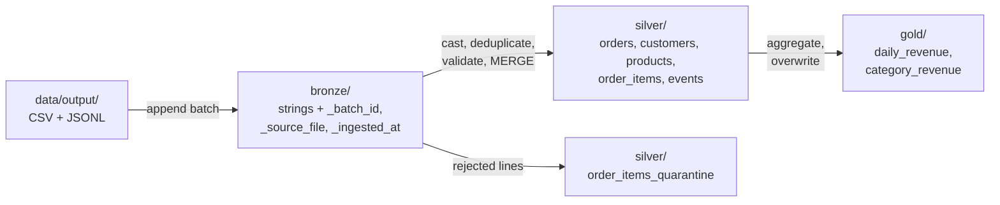

# Lab 03 — Lakehouse with PySpark and Delta Lake

Build a bronze → silver → gold pipeline on Delta tables with PySpark, then use the features that make a lakehouse table different from a folder of Parquet files: `MERGE`, the transaction log, time travel, schema enforcement, and file compaction.

| | |
|-|-|
| **Time** | 90–120 minutes |
| **Runs on** | Python + PySpark + Delta Lake in local mode (no Docker, no cluster) |
| **Needs** | Java 17 or 21 (`java -version`). On Windows, use WSL2: Spark on native Windows needs extra Hadoop binaries. |
| **Guides** | [PySpark](../../docs/02-processing/pyspark-reference.md) · [Databricks](../../docs/02-processing/databricks-reference.md) · [Apache Iceberg](../../docs/01-storage/apache-iceberg.md) · [Ingestion & CDC](../../docs/02-processing/ingestion-cdc.md) |

## Setup

```bash
cd labs/03-spark-lakehouse
python -m venv .venv && source .venv/bin/activate
pip install -r requirements.txt

python ../data/generate.py          # writes ../data/output/
python pipeline.py                  # first run downloads the Delta JARs (~1 minute)
```

Expected output:

```text
bronze  done
silver  done
gold    done

Batch 20240101T120000
  silver.orders                     6,000 rows
  silver.order_items               14,769 rows
  silver.order_items_quarantine       146 rows
  silver.events                    30,000 rows
  gold.daily_revenue                 30 rows
```

## Pipeline



| Layer | Written with | Design choice |
|-------|--------------|---------------|
| Bronze | `append` | Every column stays a string and nothing is rejected, so a bad file never blocks ingestion and can be replayed later |
| Silver | `MERGE` | Upsert on the primary key; a row is only replaced by a **newer** `updated_at`, so re-running an old batch changes nothing |
| Silver quarantine | `MERGE` | Invalid lines are kept with a `reject_reason` instead of being dropped silently |
| Silver events | `MERGE`, partitioned by `event_date` | Duplicate deliveries removed by `event_id` |
| Gold | `overwrite` | Small aggregates, cheaper to rebuild than to update |

Tables are stored under `lakehouse/` and addressed by path. In SQL, use ``delta.`<path>` ``. The helpers in [`lake.py`](lake.py) start the Spark session and read tables, including earlier versions.

The pipeline gives the same daily revenue as the dbt project in [Lab 02](../02-dbt-transformations/README.md), built with a different engine.

## Exercises

Write your answers in [`exercises.py`](exercises.py) and run one at a time with `python exercises.py <n>`. Every exercise runs before you change it and prints a starting point. Reference answers are in [`solutions.py`](solutions.py) (`python solutions.py <n>`).

Before exercises 2 and 3, process a day of changes: a new day of orders, one late cancellation, and three customers moving country.

```bash
python ../data/simulate_changes.py
python pipeline.py
```

| # | Task | Concepts | Hint |
|---|------|----------|------|
| 1 | Inspect a Delta table on disk | Transaction log, Parquet files | After the `MERGE` there are two data files but one current version. Why? (See `VACUUM`.) |
| 2 | Read the `MERGE` metrics | `DESCRIBE HISTORY`, idempotent upserts | Expect 200 orders inserted and 1 updated, and 3 customers updated |
| 3 | Find the days that changed | Time travel (`versionAsOf`) | A full outer join on `order_date`; compare with `eqNullSafe` |
| 4 | Top 3 customers per country | Window functions in the DataFrame API | `Window.partitionBy("country").orderBy(F.col("revenue").desc())` |
| 5 | Schema enforcement and evolution | `mergeSchema`, `RESTORE` | The first append fails with `DELTA_METADATA_MISMATCH` |
| 6 | Partition pruning and compaction | `explain()`, `OPTIMIZE` | Look for `PartitionFilters` vs `DataFilters` in the plan |
| 7 | Measure late-arriving data | Event time vs processing time | The maximum delay tells you how far back a daily job must reprocess |

## Questions to answer

- Run `python pipeline.py` again without changing the data. Why do the silver row counts stay the same, while bronze grows by one batch?
- The silver `MERGE` only updates a row when `s.updated_at > t.updated_at`. What would go wrong without that condition if an old batch were replayed?
- Gold is overwritten on every run. At what data size would you switch it to an incremental `MERGE` like silver, and what would the merge key be?
- Events are partitioned by `event_date`. Why not by `customer_id`? (See partitioning in the [PySpark guide](../../docs/02-processing/pyspark-reference.md).)

## Going further

- Add a `vacuum()` step with a retention period. Can you still time travel to version 0 afterwards?
- Enable [Change Data Feed](https://docs.delta.io/latest/delta-change-data-feed.html) on `silver.orders` (`delta.enableChangeDataFeed = true`) and rebuild gold from the changed rows only.
- Rewrite the silver layer with Apache Iceberg (`iceberg-spark-runtime`) and compare `MERGE INTO` syntax.
- Generate a larger dataset (`--days 365 --orders-per-day 5000`) and watch the Spark UI at http://localhost:4040 while the pipeline runs. Remove `spark.ui.showConsoleProgress=false` to see the progress bars.

## Clean up

```bash
rm -rf lakehouse spark-warehouse
```
