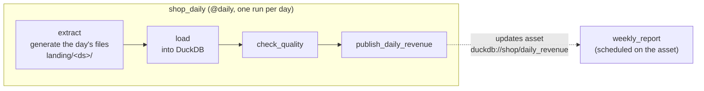

# Lab 05 — Orchestration with Airflow

Schedule a daily batch pipeline with Apache Airflow 3: run it, backfill a week of history, find and fix a task that is not idempotent, add a quality gate that stops bad data from being published, and trigger a downstream DAG from a data asset instead of a clock.

| | |
|-|-|
| **Time** | 90–120 minutes |
| **Runs on** | Docker: Airflow 3.3 (single container) + Postgres for Airflow's metadata, about 1.1 GB of memory |
| **Guides** | [Airflow](../../docs/03-orchestration/airflow-reference.md) · [Data Quality](../../docs/05-quality-governance/data-quality.md) · [Ingestion & CDC](../../docs/02-processing/ingestion-cdc.md) · [Docker](../../docs/06-infrastructure/docker-reference.md) |

## Setup

```bash
cd labs/05-airflow-orchestration
echo "AIRFLOW_UID=$(id -u)" > .env      # Linux/WSL: files written by Airflow stay owned by you
docker compose up -d --build --wait     # first build takes a few minutes
```

Open http://localhost:8080. No login is needed, because the lab turns authentication off. Both DAGs, `shop_daily` and `weekly_report`, are listed and unpaused.

The commands below run the Airflow CLI and Python inside the container:

```bash
af() { docker compose exec airflow airflow "$@"; }
q()  { docker compose exec airflow python -c "import duckdb,sys; duckdb.connect('/opt/lab/warehouse/shop.duckdb', read_only=True).sql(sys.argv[1]).show()" "$1"; }
```

## The pipeline



| Concept | Where |
|---------|-------|
| One run per logical date (`ds`), landing files partitioned by date | `extract` in [`dags/shop_daily.py`](dags/shop_daily.py) |
| Retries with a delay; none on the quality check, because re-running it won't change the result | `default_args`, `check_quality` |
| A **pool** with one slot, because DuckDB allows only one writer at a time | `pool="duckdb"`, created in [`docker-compose.yml`](docker-compose.yml) |
| A runtime **parameter** | `params={"orders_per_day": ...}` |
| **Asset**-based scheduling | `outlets=[DAILY_REVENUE]` and [`dags/weekly_report.py`](dags/weekly_report.py) |
| `catchup=False` with explicit backfills | `@dag(...)` |

The warehouse is `warehouse/shop.duckdb`, and the landing files and reports are also under `warehouse/` on your machine.

## Exercises

### 1. Run one day

```bash
af dags trigger shop_daily --logical-date 2024-03-01T00:00:00+00:00
```

In the UI, open `shop_daily`, then the run, and read the log of each task. Then check the results:

```bash
q "select * from daily_revenue"
```

1. `weekly_report` also ran. Nothing scheduled it by time, so what triggered it? Find the asset under **Assets** in the UI.
2. What is the difference between the run's **logical date** (2024-03-01) and the time it actually ran?

### 2. Backfill a week

```bash
af backfill create --dag-id shop_daily --from-date 2024-03-02 --to-date 2024-03-07
```

Watch the runs in the grid view. Only one runs at a time (`max_active_runs=1`), and the DuckDB tasks wait for a slot in the `duckdb` pool (**Admin → Pools**).

```bash
q "select order_date, count(*) as orders from orders group by 1 order by 1"
```

1. The DAG has `catchup=False`. What would have happened when it was first deployed with `catchup=True`?
2. Why does `extract` write to a folder named after `ds` rather than a fixed folder?

### 3. Re-run a day, and fix the load

Pipelines are re-run all the time: after a failure, a bug fix, or a late correction in the source. Clear one day so it runs again:

```bash
af tasks clear shop_daily --start-date 2024-03-03 --end-date 2024-03-03 --yes
# wait for the run to finish, then:
q "select order_date, count(*) as rows, count(distinct order_id) as orders from orders group by 1 order by 1"
q "select * from daily_revenue order by 1"
```

2024-03-03 now has 400 rows for 200 orders, and its revenue is about 3.5 times the other days. Each duplicated order joins to its duplicated lines. The `load` task appends, so it is **not idempotent**.

Fix `load` in [`dags/shop_daily.py`](dags/shop_daily.py) so that running it any number of times for a day gives the same result. Airflow reloads the file within about 10 seconds. Then clear 2024-03-03 again and check that it has 200 rows and normal revenue.

Hint: delete the day's rows, then insert them, inside one transaction (`BEGIN` … `COMMIT`). See idempotent loads in [Ingestion & CDC](../../docs/02-processing/ingestion-cdc.md).

### 4. Add a quality gate

`check_quality` currently passes everything, which is how the duplicated day in exercise 3 was published. Implement the checks listed in its TODO so the task raises an exception when the day's data looks wrong. Then run a day with far too few orders:

```bash
af dags trigger shop_daily --logical-date 2024-03-10T00:00:00+00:00 --conf '{"orders_per_day": 20}'
```

The run should fail at `check_quality`, and `publish_daily_revenue` should be `upstream_failed`, so the bad day never reaches `daily_revenue`. Read the failure message in the task log.

1. Why does `check_quality` have `retries=0` when the other tasks retry twice?
2. How would you publish a day that failed the check after confirming that the low volume was real, for example a holiday? Consider marking the task as success in the UI, or triggering with a lower threshold passed as a parameter.

### 5. Asset-driven scheduling

1. Open **Assets**, then `duckdb://shop/daily_revenue`. How many times was the asset updated, and which runs did it trigger?
2. Look at `warehouse/reports/revenue_last_7_days.csv`. When a backfill updates the asset seven times in a row, does `weekly_report` run seven times?
3. Change `weekly_report` to run only when **both** `daily_revenue` and a second asset have been updated (`schedule=(asset_a & asset_b)`). What real-world situation would need this?

## Going further

- Replace the DuckDB SQL in `load` and `publish_daily_revenue` with a `dbt build --select ...` of the [Lab 02](../02-dbt-transformations/README.md) project, run from a `BashOperator` or with [Astronomer Cosmos](https://astronomer.github.io/astronomer-cosmos/).
- Add a sensor that waits for the day's landing file to exist before `load`, using `deferrable=True` so it doesn't hold a worker slot while waiting.
- Add an `on_failure_callback` that writes an alert (to a file, Slack, or email) when `check_quality` fails.
- Split `extract` into [dynamic task mapping](https://airflow.apache.org/docs/apache-airflow/stable/authoring-and-scheduling/dynamic-task-mapping.html) over the source files.

## Clean up

```bash
docker compose down -v      # stops Airflow and deletes its metadata database
rm -rf warehouse
```

Reference answer: [`solutions/shop_daily.py`](solutions/shop_daily.py). To try it, copy it over `dags/shop_daily.py`.
